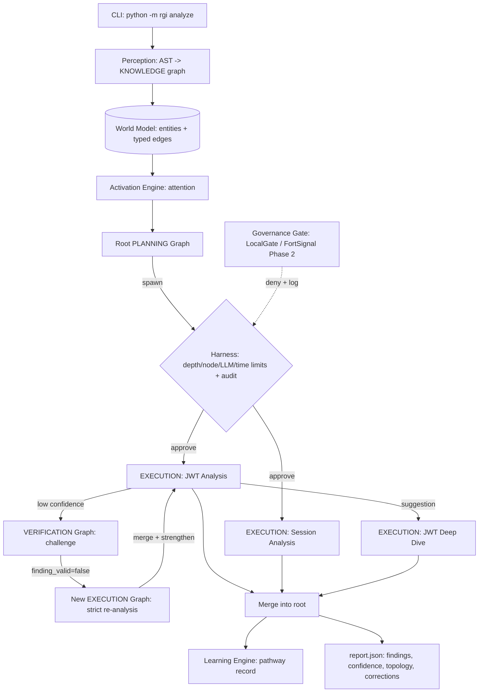

# RGI — Recursive Graph Intelligence

RGI treats the LLM as a **reasoning primitive inside graph nodes** — it never
orchestrates. Intelligence emerges from graph topology, feedback loops, and
recursive spawning, not from a monolithic agent loop. A single CLI objective
decomposes into recursive subgraphs (planning → execution → verification),
low-confidence findings trigger topological self-correction (a *new* execution
graph, not a retry), and every spawn, rejection, and correction is recorded in
a replayable audit trail.

## Architecture



## Quickstart

```bash
pip install -r requirements.txt
python -m rgi analyze sample_project --objective "Analyze authentication security" --mock
```

`--mock` uses a deterministic fixture-driven LLM — no API key needed, fully
reproducible. The run prints and writes `report.json` (findings, confidence
scores, graph topology used, correction history); per-graph states and the
audit trail land in `data/` (gitignored). A committed `report.json` from a
mock run is included as example output.

## Real LLM usage

```bash
export RGI_LLM_API_KEY=sk-...
# optional overrides:
export RGI_LLM_BASE_URL=...   # default preset: Kimi's OpenAI-compatible endpoint
export RGI_LLM_MODEL=...

python -m rgi analyze sample_project --objective "Analyze authentication security"
```

Any OpenAI-compatible chat-completions endpoint works (JSON mode). Without
`RGI_LLM_API_KEY` the CLI falls back to the mock client.

## Brain mapping — the v0.2/v0.3 North Star

The brain model is the architectural language and North Star, not the v0.1
implementation target. v0.1 builds the formal, evaluable version behind
stable interfaces; v0.2/v0.3 evolve the dynamics without changing them.

| RGI component | Brain analog | v0.1 implementation |
|---|---|---|
| Activation engine | Attention | Keyword-seed matching + one-hop decay propagation |
| Harness | Basal ganglia (action selection) | Permission-scheduler with hard caps (depth/nodes/LLM calls/time) |
| Verification loop | Anterior cingulate cortex (conflict detection) | Deterministic trigger on confidence < threshold |
| Learning engine | Plasticity | Records pathways only (objective → topology → outcome) |
| Perception | Sensory cortex | `ast`-based parsing → KNOWLEDGE graph |
| World model | Long-term / semantic memory | Entities + typed edges persisted in `data/` |
| Context builder | Working memory | Node + top-5 activated neighbors + policy, ~4000-token cap |
| Recursive spawning | Neurogenesis (v0.3 direction) | Suggested subgraphs approved by the harness |

## Testing

```bash
pytest -v
```

The suite (16 files, all on the mock LLM) proves the core claims:

- `tests/test_recursive_spawn.py` — **the safety proof**: a chain of 5 spawn
  attempts with `max_depth=2` creates only depth-0 and depth-1 graphs; the
  rest are rejected with logged reasons.
- `tests/test_self_correction.py` — self-correction is **topological**:
  verification spawns a NEW execution graph, the original node passes through
  CORRECTING, and aggregate confidence rises.
- `tests/test_harness_limits.py` — harness rejects spawns past the node/LLM
  budget and depth caps.
- `tests/test_governance.py` — a tool call with a path outside the analysis
  target is denied and logged.
- `tests/test_e2e_mock.py` — full demo scenario completes < 5 min and < 20
  LLM calls and produces a valid `report.json`.
- `tests/test_activation.py`, `test_audit.py`, `test_context_builder.py`,
  `test_engine.py`, `test_learning.py`, `test_llm_client.py`, `test_loops.py`,
  `test_models.py`, `test_perception.py`, `test_sample_project.py`,
  `test_tools.py` — unit coverage of each subsystem.

## Roadmap

- **v0.2** — real spreading activation (beyond keyword seeds), parallel
  cross-inhibition between loops, edge-weight learning from recorded pathways.
- **v0.3** — inhibition-default harness (the basal-ganglia stance), neurogenesis-
  style spawning, Hebbian plasticity on edges; learned activation/spawn policies
  gated on accumulated pathway data.
- **Phase 2** — FortSignal live integration per design doc §3.7
  (`FortSignalGate` behind the `GovernanceGate` protocol: deterministic
  enforcement, signed receipts into the audit log) and the protocol spec.

## Layout

```
rgi/            core/ loops/ memory/ perception/ reasoning/ tools/ cli.py
sample_project/ 4-file Python app with intentional auth vulnerabilities
tests/          pytest + pytest-asyncio, all on the mock LLM
data/           graph states, pathways, audit.jsonl (gitignored)
```
