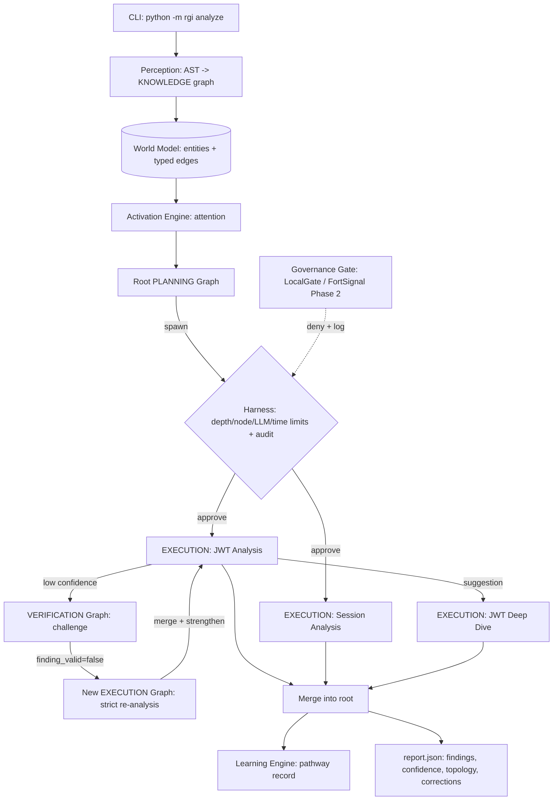

# RGI — Recursive Graph Intelligence

**RGI is a hybrid architecture: neural judgment where judgment is needed,
engineered structure where discipline is needed — and a measurable
exchange rate between the two.**

The LLM never orchestrates; it is a **reasoning primitive inside graph
nodes**. The graph provides what the model cannot: decomposition,
coverage accountability, resource governance, and a replayable audit
trail. The model provides what the graph cannot: judgment over meaning.
A single CLI objective decomposes into recursive subgraphs (planning →
execution → verification), low-confidence findings trigger topological
self-correction (a *new* execution graph, not a retry), and every spawn,
rejection, and correction is recorded deterministically.

**Measured so far** (controlled benchmarks, full receipts in
`docs/reports/`): adaptive topology doubles a fixed pipeline at the 7B
local tier (0.711 vs 0.355) and holds recall flat (0.71–0.73) across
model families while pipelines swing 0.36–0.98; an ablation control
confirms causation with dose-response (0.333 → 0.445 → 0.711); and
topology grows with problem complexity — every run spawning ≥11 graphs
scored 1.0. See `docs/reports/figures/`.

> Research vision and paper draft: `docs/vision.md`, `docs/architecture.md`,
> `paper/recursive-graph-intelligence.md`.

## Architecture



## Quickstart

```bash
pip install -r requirements.txt

# The demo: one objective -> recursive subgraphs -> report
python -m rgi analyze sample_project --objective "Analyze authentication security" --mock

# The experiment: RGI vs single-shot baseline vs fixed workflow (Control B)
python -m rgi compare sample_project --objective "Analyze authentication security" --mock
python -m rgi eval --objective "Analyze code security" --runs 3 --mock
```

`--mock` uses a deterministic fixture-driven LLM — no API key needed, fully
reproducible. `analyze` prints and writes `report.json`; `compare` writes
`compare.json`; `eval` runs the target × condition × repetition matrix against
ground truth and writes `eval_report.json`. Per-graph states and the audit
trail land in `data/` (gitignored). Committed example outputs live in
`examples/`.

## Real LLM usage

```bash
export RGI_LLM_API_KEY=sk-...
# optional overrides:
export RGI_LLM_BASE_URL=...   # any OpenAI-compatible endpoint (tested: DeepSeek)
export RGI_LLM_MODEL=...

python -m rgi eval --objective "Analyze code security" --runs 3 --target vuln_app_3
```

Any OpenAI-compatible chat-completions endpoint works (JSON mode). Without
`RGI_LLM_API_KEY` every command falls back to the mock client.

## Current status

See `docs/reports/2026-08-04-rgi-status-report.md` — four graded live
experiments, the four-tier evaluation framework, and the honest verdict:
self-correction proven live; topology advantage unproven at small scale
(ceiling effect); decisive experiment is a 100+ file target requiring
embedding-based activation.

## Brain mapping — the v0.2/v0.3 North Star

The brain model is the architectural language and North Star, not the v0.1
implementation target. v0.1 builds the formal, evaluable version behind
stable interfaces; v0.2/v0.3 evolve the dynamics without changing them.

| RGI component | Brain analog | v0.1 implementation |
|---|---|---|
| Activation engine | Attention | Keyword-seed matching + one-hop decay propagation |
| Harness | Basal ganglia (action selection) | Permission-scheduler with hard caps (depth/nodes/LLM calls/time) |
| Verification loop | Anterior cingulate cortex (conflict detection) | Deterministic trigger on confidence < threshold |
| Learning engine | Plasticity | Records pathways only (objective → topology → outcome) |
| Perception | Sensory cortex | `ast`-based parsing → KNOWLEDGE graph |
| World model | Long-term / semantic memory | Entities + typed edges persisted in `data/` |
| Context builder | Working memory | Node + top-5 activated neighbors + policy, ~4000-token cap |
| Recursive spawning | Neurogenesis (v0.3 direction) | Suggested subgraphs approved by the harness |

## Testing

```bash
pytest -v
```

The suite (25 test files, 72 tests, all on the mock LLM) proves the core claims:

- `tests/test_recursive_spawn.py` — **the safety proof**: a chain of 5 spawn
  attempts with `max_depth=2` creates only depth-0 and depth-1 graphs; the
  rest are rejected with logged reasons.
- `tests/test_self_correction.py` — self-correction is **topological**:
  verification spawns a NEW execution graph, the original node passes through
  CORRECTING, and aggregate confidence rises.
- `tests/test_harness_limits.py` — harness rejects spawns past the node/LLM
  budget and depth caps; verification LLM calls are budget-gated too.
- `tests/test_governance.py` — a tool call with a path outside the analysis
  target is denied and logged.
- `tests/test_e2e_mock.py` — full demo scenario completes < 5 min and < 20
  LLM calls and produces a valid `report.json`.
- `tests/test_eval.py`, `test_baseline.py`, `test_fixed_workflow.py` — the
  experiment harness: single-shot baseline, fixed-workflow Control B, and the
  target × condition × repetition eval matrix with ground-truth scoring.
- `tests/test_seeding.py`, `test_grounding.py`, `test_live_readiness.py` —
  v0.2 hardening: synonym-expanded activation, code-grounded execution,
  exception containment, confidence clamping.
- `tests/test_benchmarks.py`, `test_hard_benchmark.py` — benchmark targets and
  ground truth are scorable, including the 15-file cross-file vuln_app_3.
- Unit coverage per subsystem: `test_activation.py`, `test_audit.py`,
  `test_context_builder.py`, `test_engine.py`, `test_learning.py`,
  `test_llm_client.py`, `test_loops.py`, `test_models.py`,
  `test_perception.py`, `test_sample_project.py`, `test_tools.py`.

## Roadmap

- **v0.2 (in progress)** — DONE: grounded planning/execution, salience-gated
  spawning, synonym-expanded seeding, exception containment, baseline +
  Control B + eval matrix, three benchmark targets, embedding-based spreading
  activation, spawn-round cap (Run 5 fix). NEXT: report hygiene
  (findings dedup, per-file attribution), then the decisive context-pressure
  experiments — small-model matrix (Run 5) and the 100+ file benchmark
  (see status report, Run 4 verdict).
- **v0.3** — inhibition-default harness (the basal-ganglia stance), parallel
  cross-inhibition between loops, neurogenesis-style spawning, Hebbian
  plasticity on edges; learned activation/spawn policies gated on accumulated
  pathway data.
- **Phase 2** — FortSignal live integration per design doc §3.7
  (`FortSignalGate` behind the `GovernanceGate` protocol: deterministic
  enforcement, signed receipts into the audit log) and the protocol spec.

## Layout

```
rgi/            core/ loops/ memory/ perception/ reasoning/ tools/
                cli.py  eval.py  baseline.py  fixed_workflow.py
sample_project/ 4-file app with planted auth vulnerabilities (target 1)
benchmarks/     vuln_app_2 (4 vuln classes), vuln_app_3 (15 files,
                cross-file vulns), ground_truth/ scoring files
examples/       committed report.json + compare.json from mock runs
tests/          pytest + pytest-asyncio, all on the mock LLM
docs/           specs, plans, and the status report (see docs/README.md)
data/           graph states, pathways, audit.jsonl (gitignored)
```
